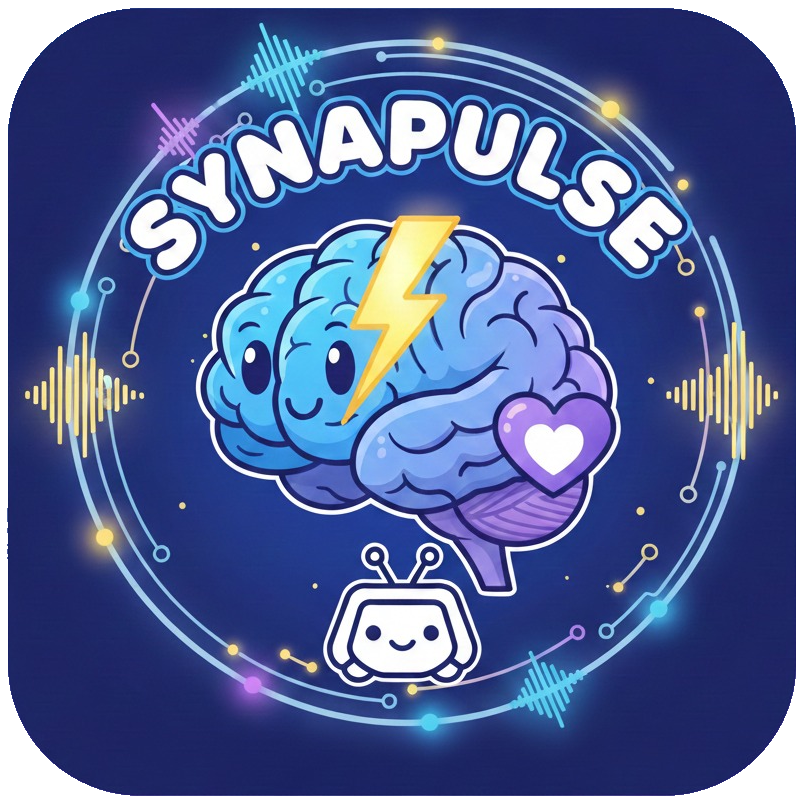

<p align="center">
  
</p>

# Synapulse

Synapse + Pulse — 基于 Discord 和 AI 的个人助手。

Synapulse 是一个可自托管的 AI 助手，运行在你的 Discord 服务器中。通过 @提及
与它对话，它可以搜索网页、管理待办事项、记笔记、设置提醒、执行 Shell 命令、总结邮件等等。它会记住你跨会话的对话内容，并且可以通过新增工具或接入
MCP 协议连接数百种外部服务来扩展能力。

## 演示

|                                 天气查询                                  |                                 搜索推荐                                 |
|:---------------------------------------------------------------------:|:--------------------------------------------------------------------:|
|  |  |

|                                       提醒 — 通知模式                                       |                                提醒 — AI 执行模式                                 |
|:-------------------------------------------------------------------------------------:|:---------------------------------------------------------------------------:|
|  |  |

## 功能特性

- **AI 对话** — 在 Discord 中 @提及机器人即可聊天，开箱即用支持多种 AI 提供商。
- **工具调用** — AI 可以在一条消息中进行多轮工具调用（最多 10 轮）。工具在启动时自动发现——放入新文件夹、重启即可。
- **Shell 执行** — AI 主动使用 Shell 命令处理系统查询、计算、Git 操作等。跨平台支持：Windows 使用 PowerShell，Linux/macOS 使用
  bash。
- **持久记忆** — 对话自动保存并生成摘要。机器人能记住你昨天、上周甚至上个月聊过的内容。
- **任务管理** — 追踪待办事项，支持优先级和截止日期。AI 在每次对话中都能看到你的待办任务，并主动提醒即将到期的事项。
- **备忘录** — 保存和搜索个人笔记。问一句"我之前存的 XX 是什么？"，AI 就能找到。
- **提醒** — 支持相对时间（`+5m`、`+1h`）和绝对时间。两种模式：**通知模式**用于被动提醒，**AI 执行模式**用于定时 AI 任务（如"
  1小时后告诉我天气"——到时间时机器人会真的去查天气）。
- **文件操作** — 在允许的路径内读取、写入、搜索和管理本地文件。
- **邮件监控** — 后台任务通过 IMAP 监控 Gmail、Outlook 和 QQ 邮箱，用 AI 总结新邮件并推送通知到 Discord。
- **MCP 集成** — 连接任何 [MCP](https://modelcontextprotocol.io/) 服务器（GitHub、Notion、文件系统、数据库等），无需写代码即可接入数百种工具。按需加载工具
  Schema，节省 Token 用量。
- **多模型轮转** — 基于 YAML 的多端点配置，支持标签过滤、轮询调度和速率限制自动降级。
- **通知交互** — 回复机器人的任何消息（邮件通知、之前的回答），AI 会自动看到原始内容作为上下文。
- **热更新配置** — 模型、MCP 服务器和任务调度均可在运行时更新，无需重启。

## 快速开始

需要 **Python 3.11+**。

```bash
# 1. 克隆并安装
git clone https://github.com/YourUser/Synapulse.git
cd Synapulse
pip install -r apps/bot/requirements.txt

# 2. 配置
cp .env.example .env
# 编辑 .env —— 至少填入 DISCORD_TOKEN

# 3. 运行
python -m apps.bot.main
```

默认使用 `mock` AI 提供商——不需要任何 AI 密钥即可验证安装是否成功。在 `.env` 中设置 `AI_PROVIDER` 切换到真实的 AI 提供商。

## 配置说明

### 环境变量（`.env`）

所有密钥和提供商选择都在 `.env` 文件中。复制 `.env.example` 开始配置。

| 变量                                         | 是否必需         | 说明                                                                 |
|:-------------------------------------------|:-------------|:-------------------------------------------------------------------|
| `DISCORD_TOKEN`                            | 是            | Discord 机器人令牌（[在此创建](https://discord.com/developers/applications)） |
| `AI_PROVIDER`                              | 否            | `mock`（默认）、`copilot` 或 `ollama`                                    |
| `AI_MODEL`                                 | 否            | 模型名称，如 `gpt-4o-mini`（默认）                                           |
| `GITHUB_TOKEN`                             | copilot 需要   | 未设置时会自动通过 OAuth Device Flow 获取                                     |
| `GITHUB_CLIENT_ID`                         | copilot 需要   | OAuth 应用的 Client ID，用于 Device Flow 认证                              |
| `OLLAMA_BASE_URL`                          | ollama 需要    | 默认：`http://localhost:11434`                                        |
| `BRAVE_API_KEY`                            | 搜索需要         | [在此获取](https://brave.com/search/api/)                              |
| `LOCAL_FILES_ALLOWED_PATHS`                | 文件浏览需要       | 逗号分隔的允许路径，如 `D:\docs,E:\projects`                                  |
| `GMAIL_ADDRESS` / `GMAIL_APP_PASSWORD`     | Gmail 监控需要   | [创建应用专用密码](https://myaccount.google.com/apppasswords)              |
| `OUTLOOK_ADDRESS` / `OUTLOOK_APP_PASSWORD` | Outlook 监控需要 | Outlook 应用密码                                                       |
| `QQ_MAIL_ADDRESS` / `QQ_MAIL_APP_PASSWORD` | QQ 邮箱监控需要    | QQ 邮箱授权码（设置→账户→POP3/IMAP→生成授权码）                                    |
| `LOG_LEVEL`                                | 否            | `DEBUG`（默认）、`INFO`、`WARNING`                                       |

### AI 提供商

| 提供商       | 配置方式                                                        | 备注                                  |
|:----------|:------------------------------------------------------------|:------------------------------------|
| `mock`    | 无需配置                                                        | 返回 "mock hello"——仅用于测试安装            |
| `copilot` | 在 `.env` 中设置 `GITHUB_CLIENT_ID`，运行后在终端按提示完成 OAuth 认证        | 使用 GitHub Models API（GPT-4o-mini 等） |
| `ollama`  | [安装 Ollama](https://ollama.ai)，拉取模型，设置 `AI_PROVIDER=ollama` | 完全本地运行，无需 API 密钥                    |

### 任务配置（`apps/bot/config/jobs.json`）

将 `jobs.json.example` 复制为 `jobs.json` 并编辑：

```json
{
  "gmail_monitor": {
    "enabled": true,
    "schedule": "*/5 * * * *",
    "notify_channel": "123456789012345678",
    "prompt": "用2-4句话总结这封邮件，抓住要点和待办事项。"
  },
  "outlook_monitor": {
    "enabled": false,
    "schedule": "*/10 * * * *",
    "notify_channel": "123456789012345678",
    "prompt": "简洁地总结这封邮件。"
  },
  "qqmail_monitor": {
    "enabled": false,
    "schedule": "*/5 * * * *",
    "notify_channel": "123456789012345678",
    "prompt": "简洁地总结这封邮件。"
  }
}
```

- `schedule` — Cron 表达式（分 时 日 月 周）。`*/5 * * * *` = 每 5 分钟。
- `notify_channel` — 推送通知的 Discord 频道 ID。在 Discord 中右键频道 → 复制频道 ID。
- `prompt` — 用于总结邮件的 AI 提示词，可按需自定义。
- 修改即时生效——无需重启。

## 使用方法

### 与机器人对话

在任意 Discord 频道中 @提及机器人：

> **@Synapulse** 东京现在天气怎么样？

机器人会搜索网页并回答。它可以在一次回复中串联多个工具调用——比如先搜索，再把找到的信息存为备忘录。

### 回复机器人消息

回复机器人的任何消息（邮件通知、之前的回答等），AI 会自动看到原始内容：

> **机器人：** 收到 John 的新邮件：明天会议改到下午3点...
>
> **你（回复）：** 翻译成英文

机器人会同时看到你的指令和原始邮件内容。

### 管理任务

> **@Synapulse** 添加一个任务：周五前提交报告，高优先级

> **@Synapulse** 我有哪些任务？

> **@Synapulse** 把任务3标记为完成

任务在重启后仍然保留。AI 在每次对话中都能看到你的待办任务，并能主动提醒即将到期的事项。

### 使用备忘录

> **@Synapulse** 存个备忘录：Wi-Fi 密码是 sunshine42

> **@Synapulse** Wi-Fi 密码是多少？

### 设置提醒

> **@Synapulse** 5分钟后提醒我喝水

> **@Synapulse** 1小时后告诉我天气

> **@Synapulse** 每周一早上9点提醒我检查报表

机器人支持两种提醒模式：

- **通知模式** — 被动提醒，如"喝水"（静态文本）
- **AI 执行模式** — 定时 AI 任务，如"告诉我天气"（到时间时机器人会真的去执行请求）

AI 会自动选择合适的模式。同时支持相对时间（`+5m`、`+1h`、`+2h30m`）和绝对时间（ISO 8601）。

## 扩展 Synapulse

### 添加新工具

工具会在启动时自动发现。添加步骤：

1. 创建 `apps/bot/tool/your_tool/handler.py`
2. 定义一个继承 `OpenAITool` 和 `AnthropicTool` 的 `Tool` 类：

```python
from apps.bot.tool.base import AnthropicTool, OpenAITool


class Tool(OpenAITool, AnthropicTool):
    name = "your_tool"
    description = "这个工具做什么（AI 读取这段描述来决定何时使用它）"
    parameters = {
        "type": "object",
        "properties": {
            "query": {
                "type": "string",
                "description": "要查询的内容",
            },
        },
        "required": ["query"],
    }
    usage_hint = "系统提示词中的简短说明"

    def validate(self) -> None:
        pass  # 在此检查配置/API 密钥

    async def execute(self, query: str) -> str:
        # 执行工作，返回文本结果
        return f"查询 {query} 的结果"
```

3. 重启机器人。工具会自动出现在 AI 的工具列表中。

**可用的注入属性**（由 core 在启动时设置）：

- `self.db` — 数据库实例，用于持久化存储（备忘录、任务等）
- `self.send_file` — 发送文件到 Discord 的回调（每条消息设置）
- `self.channel_id` — 当前频道 ID（每条消息设置）

### 添加 MCP 服务器

MCP（Model Context Protocol，模型上下文协议）让你无需写代码即可接入外部工具服务器。

**方式一：静态配置文件**

编辑 `apps/bot/config/mcp.json`：

```json
{
  "mcpServers": {
    "filesystem": {
      "command": "npx",
      "args": [
        "-y",
        "@modelcontextprotocol/server-filesystem",
        "/home/user/docs"
      ],
      "env": {},
      "timeout": 30000
    },
    "github": {
      "command": "npx",
      "args": [
        "-y",
        "@modelcontextprotocol/server-github"
      ],
      "env": {
        "GITHUB_PERSONAL_ACCESS_TOKEN": "ghp_xxxx"
      }
    }
  }
}
```

重启机器人，它会自动连接所有配置的服务器并发现其提供的工具。

**方式二：通过 Discord 对话**

直接告诉机器人：

> **@Synapulse** 连接一个叫 "github" 的 MCP 服务器，命令是 "npx"，参数是 ["-y", "@modelcontextprotocol/server-github"]

AI 会调用 `mcp_server` 工具进行连接，新工具立即可用——无需重启。配置会自动持久化，重启后仍然有效。

> **@Synapulse** 我有哪些 MCP 服务器？

> **@Synapulse** github 服务器提供了哪些工具？

> **@Synapulse** 断开 filesystem 服务器

可在 [MCP 服务器目录](https://github.com/modelcontextprotocol/servers) 浏览可用的 MCP 服务器。

### 添加新的 AI 提供商

1. 创建 `apps/bot/provider/your_provider/chat.py`
2. 定义一个继承 `OpenAIProvider` 或 `AnthropicProvider` 的 `Provider` 类
3. 实现 `authenticate()` 和 `chat()` 方法
4. 在 `.env` 中设置 `AI_PROVIDER=your_provider`

### 添加新的后台任务

1. 创建 `apps/bot/job/your_job/handler.py`
2. 定义一个继承 `CronJob` 或 `ListenJob` 的 `Job` 类
3. 在 `jobs.json` 中添加对应的配置项
4. 重启机器人

## 内置工具

| 工具             | 说明                                 | 前置条件                        |
|:---------------|:-----------------------------------|:----------------------------|
| `shell_exec`   | 执行 Shell 命令（跨平台：PowerShell / bash） | `LOCAL_FILES_ALLOWED_PATHS` |
| `local_files`  | 读取、写入、搜索和管理本地文件                    | `LOCAL_FILES_ALLOWED_PATHS` |
| `brave_search` | 通过 Brave Search API 搜索网页           | `BRAVE_API_KEY`             |
| `weather`      | 当前天气和 3 天预报（OpenWeatherMap）        | `OPENWEATHER_API_KEY`       |
| `memo`         | 保存、搜索、列出、删除个人笔记                    | —                           |
| `reminder`     | 定时提醒，支持通知/AI 执行双模式和相对时间            | —                           |
| `task`         | 待办事项管理，支持优先级和截止日期                  | —                           |
| `mcp_server`   | 管理 MCP 服务器连接（添加、移除、列出、使用工具）        | —                           |

## 项目结构

```
Synapulse/
├── apps/bot/                    # 主应用
│   ├── main.py                  # 入口
│   ├── config/                  # 配置、提示词、日志
│   ├── core/                    # 编排层（启动、工具调用循环、加载器、提醒检查器）
│   ├── provider/                # AI 提供商（mock、copilot、ollama）
│   ├── channel/                 # 平台 I/O（discord）
│   ├── tool/                    # AI 工具（自动发现）
│   ├── job/                     # 后台任务（自动发现）
│   ├── mcp/                     # MCP 客户端管理器
│   └── memory/                  # 持久化存储（基于 JSON）
├── config/                      # 运行时配置（models.yaml、mcp.json、jobs.json）
├── output/                      # 运行时输出（日志、数据）
├── tests/                       # 单元测试（pytest）
├── scripts/                     # 构建、测试、运行脚本
├── requirements/                # 需求和设计文档
└── docs/                        # 设计笔记
```

## 架构

```
用户 ──→ Discord ──→ 频道层 ──→ 核心（工具调用循环）──→ AI 提供商
                                     │
                                     ├── 原生工具（搜索、备忘录、任务……）
                                     ├── MCP 工具（GitHub、Notion、文件系统……）
                                     ├── 记忆（对话历史、摘要）
                                     └── 后台任务（邮件监控）
```

核心设计原则：

- **动态加载** — 工具和任务通过文件夹扫描自动发现。放入新文件夹，重启即可。
- **控制反转** — 核心层向被动层注入回调。各层之间互不导入。
- **优雅降级** — 缺少配置、工具失败、MCP 服务器崩溃——一切都是隔离的。机器人持续运行。

## 开发

```bash
# 运行测试
python -m pytest tests/ -v

# 构建检查（语法验证）
bash scripts/build.sh

# 运行机器人
python -m apps.bot.main
```

## 许可证

[MIT](LICENSE)
